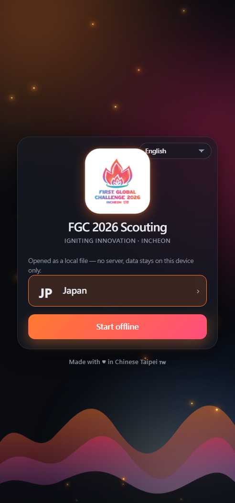
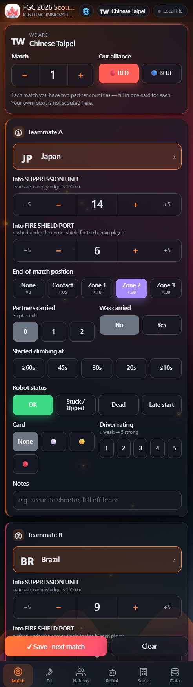
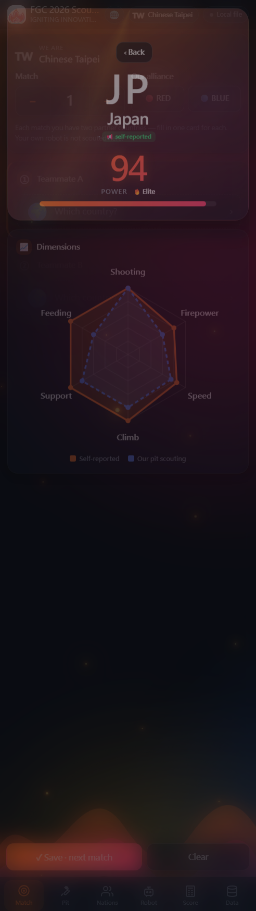

<div align="center">

# FGC 2026 Scouting

**Scouting app for the 2026 FIRST Global Challenge — _Igniting Innovation_, Incheon.**

Every nation gets its own login. Track matches and pit interviews privately,
and publish your robot's specs so the teams you get randomly allied with
actually know what you can do.

[**→ Live app**](https://fgc-scout.duckdns.org) · [Install on your phone](https://fgc-scout.duckdns.org/install)

  

</div>

---

## Why

At FGC your alliance partners are randomised every match and you get about three
minutes to plan with two teams you've never met, who may not share a language
with you. This app exists so that in those three minutes you already know
whether they can score in the SUPPRESSION UNIT, how long their climb takes, and
whether they can carry you.

## What it does

- **Match scouting** — one card per partner country, so the two robots you play
  with are recorded separately instead of lumped together. Balls into the
  SUPPRESSION UNIT and the FIRE SHIELD PORT, climb zone, partners carried,
  robot status, driver rating.
- **Pit scouting** — capacity, shooter type (single / dual / triple / waterfall),
  time to empty a full load, climb height and speed, preferred field position
  (tap it on a map of the field), roles, languages, breakdowns.
- **Your robot, shared** — fill your own specs in once and hit **Publish**.
  Every signed-in team can then read it, and you can read theirs. Optional photos.
- **Nation pages** — a 6-axis radar (self-reported vs. what we observed), a
  power score, your match averages, and their own description.
- **Score calculator** — SUPPRESSION × (1 + Σ climb multipliers) + partner
  climbs + EXTINGUISHER + Coopertition.
- **20 languages**, English by default, with right-to-left support for Arabic,
  Urdu and Persian.
- **Works offline.** Event wifi is always rough — entries are kept locally and
  merged when you reconnect.
- **Installs to the home screen** on iOS (configuration profile) and Android (PWA).

Your scouting notes stay private to your team. Only the robot profile you
explicitly publish is shared.

## Using it without running anything

Just open <https://fgc-scout.duckdns.org>, pick your country, and sign in with
the default password `password`. That instance is run by Team Chinese Taipei and
is free for every team.

Prefer something you can carry on a USB stick? `FGC2026_Scouting.html` is a
single self-contained file (≈700 KB, all 20 languages and all flags inlined).
Open it in any browser — no server, no internet, no sync.

## Running your own instance

Requirements: a Linux box with Python 3.9+ (nothing else — the server is pure
standard library) and a domain name.

```bash
git clone https://github.com/<you>/fgc2026-scouting.git
cd fgc2026-scouting
python3 server.py --port 8080          # http://localhost:8080
```

For a real deployment (systemd, automatic HTTPS via Caddy, firewall) there is a
one-shot setup script and a deploy script in [`deploy/`](deploy/) — see
[deploy/DEPLOY.md](deploy/DEPLOY.md). It takes about fifteen minutes on any
US$5/month VPS.

### How accounts work

Every nation in `web/nations.js` is an account. The default password is
`password`; the first person to sign in is asked to set a real one for the team
(they can skip it). Passwords are PBKDF2-SHA256 with a per-team salt. There is
no email, no personal data, and no third-party service involved.

Forgot a password? The organiser runs:

```bash
python3 server.py --reset-password <country-slug>
```

## Layout

```
server.py             HTTP server + sync/auth/profile API (stdlib only, ~500 lines)
build_single.py       bundles web/ into the one-file offline build
web/
  index.html          the app
  app.css  app.js     UI and logic, no framework, no build step
  i18n*.js            20 languages
  nations.js          175 nations (slug, name, flag, Chinese name)
  flags/              175 SVG flags
  sw.js               offline cache
  install.html        iOS profile / PWA install page
deploy/               setup.sh, push.ps1, pull-data.ps1, runbook
docs/                 form specification (Traditional Chinese)
```

There is no build step, no npm, no framework. Edit a file, reload the page.

## API

All endpoints take `X-Token` from `/api/login` except where noted.

| Method | Path | Purpose |
|---|---|---|
| `POST` | `/api/login` | `{team, password}` → `{token, mustChange}` |
| `POST` | `/api/password` | change the team password |
| `GET` | `/api/state` | whole dataset for your team |
| `POST` | `/api/sync` | send changes, receive merged state (or `{nochange}`) |
| `POST` | `/api/profile` | save/publish your robot profile |
| `GET` | `/api/profiles` | every published profile |
| `POST` | `/api/photo` | upload a robot photo (shrunk client-side) |
| `GET` | `/health` | no auth — liveness and counts |
| `GET` | `/install.mobileconfig` | iOS web-clip profile, generated for the host you requested it from |

Sync is dirty-flag based: a device only uploads when it has local changes,
otherwise it polls every 30 seconds with its revision number and the server
answers `{"nochange": true}` in 28 bytes. Polling stops entirely while the app
is backgrounded.

## Contributing

Found a bug during the event? Open an issue — especially if something reads
badly in your language, the translations were done without native speakers for
most of the 20.

## Licence

MIT for the code. The FIRST Global name and the FGC 2026 logo belong to
FIRST Global; see [LICENSE](LICENSE).

Built by **Team Chinese Taipei** 🇹🇼 for everyone competing in Incheon.
